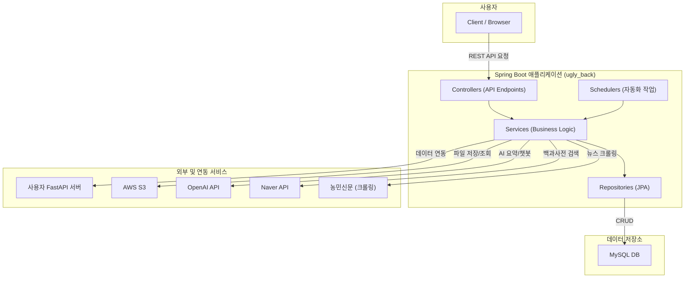

# 농산물 정보 제공 및 관리 백엔드

## 1. 프로젝트 개요 (Overview)

- **프로젝트 이름**: Agriculture Contest Backend
- **한 줄 요약**: 농산물 정보 조회, 관리, AI 기반 챗봇 및 외부 데이터 연동 기능을 제공하는 Spring Boot 기반 백엔드 API 서버입니다.
- **핵심 가치**: 농산물 데이터를 체계적으로 관리하고, 외부 API와 연동하여 풍부한 정보를 제공하며, AI를 통해 사용자 맞춤형 서비스를 제공하는 것을 목표로 합니다. 정기적인 데이터 파이프라인을 통해 최신 정보를 유지하고, GitHub Actions와 Docker를 통해 빌드, 테스트, 배포 자동화를 구축하여 안정적이고 효율적인 개발 및 운영 환경을 제공합니다.

## 2. 주요 기능 (Features)

### 2.1. 농작물 정보 관리 (Crop API)
- 농작물에 대한 CRUD(생성, 조회, 수정, 삭제) 기능을 제공합니다.
- **Endpoint**: `/crop`
- **API 예제**:
  - `GET /crop/all`: 모든 농작물 정보 조회
  - `POST /crop`: 새 농작물 정보 생성 (Request Body: `CropDto`)

### 2.2. 데이터 파이프라인 자동화
- **주간 농업 뉴스 요약**: `WeeklyChatTask`가 매주 월요일 12시에 농민신문 헤드라인 뉴스를 크롤링하고, OpenAI API를 통해 핵심 내용을 요약하여 데이터베이스(`tb_crop_summary`)에 저장합니다.
- **외부 데이터 수집**: `GrainV5Fetcher`는 '농사로'와 같은 외부 사이트에서 농산물 데이터를 주기적으로 수집할 수 있는 기반을 제공합니다. 현재는 수동 실행(`GET /execute/v5`)으로 트리거할 수 있으며, 향후 스케줄러에 등록하여 완전 자동화가 가능합니다.

### 2.3. AI 챗봇 (OpenAI 연동)
- `Spring AI` 라이브러리를 통해 OpenAI의 GPT 모델과 연동하여 "농업 전문가"로서 사용자 질문에 답변하는 챗봇 기능을 제공합니다.
- **Endpoint**: (관련 Controller 필요, 현재 `ChatServiceImpl`에 로직 구현)

### 2.4. 네이버 백과사전 연동 검색
- 네이버 API와 연동하여 농작물에 대한 백과사전 정보를 실시간으로 검색하고, 관련 이미지와 함께 결과를 반환합니다.
- **Endpoint**: `GET /search?query={keyword}`

### 2.5. AWS S3 기반 파일 관리
- 이미지 등의 파일을 AWS S3에 안전하게 업로드하고, Pre-signed URL을 발급하여 일정 시간 동안만 유효한 보안 링크를 제공합니다.
- **Endpoint**: `/s3/upload`, `/s3/presigned-url`

## 3. 설치 및 실행 방법 (Installation & Usage)

### 3.1. 최소 요구사항
- **Java**: `17`
- **Gradle**: `8.x` 이상
- **Database**: `MySQL`
- **Container**: `Docker`

### 3.2. 실행 예시 (Quick Start)

#### 1. 로컬에서 직접 실행
```bash
# 1. 프로젝트 클론
git clone <repository-url>
cd <project-directory>

# 2. application.yaml에 환경 변수 설정 또는 .env 파일 생성
# (DB_HOST, DB_NAME, OPENAI_API_KEY, AWS_ACCESSKEY 등)

# 3. Gradle Wrapper에 실행 권한 부여 (최초 1회)
chmod +x ./gradlew

# 4. 애플리케이션 실행
./gradlew bootRun
```

#### 2. Docker를 이용한 실행
`Dockerfile`은 Multi-stage build를 사용하여 경량화된 최종 이미지를 생성합니다.

```bash
# 1. .env 파일에 환경 변수 설정
# (DB_HOST, DB_NAME, OPENAI_API_KEY, AWS_ACCESSKEY 등)

# 2. Docker 이미지 빌드
docker build -t agriculture-backend:latest .

# 3. Docker 컨테이너 실행
docker run -d --name agriculture-app -p 8080:8080 \
  --env-file ./.env \
  agriculture-backend:latest
```

## 4. 아키텍처 & 기술 스택 (Architecture & Tech Stack)

### 4.1. 기술 스택
- **언어**: `Java 17`
- **프레임워크**: `Spring Boot 3.x`
  - `Spring Web` & `WebFlux`: 동기/비동기 REST API
  - `Spring Data JPA`: 데이터베이스 연동 (with `MySQL`)
  - `Spring AI`: OpenAI 연동을 위한 추상화
  - `Spring Cloud OpenFeign`: 선언적 REST 클라이언트 (Naver API 연동)
  - `Spring Boot Scheduler`: 주기적인 작업 자동화
- **라이브러리**: `Jsoup` (크롤링), `AWS SDK v2` (S3 연동)
- **빌드 도구**: `Gradle`
- **배포**: `Docker`, `GitHub Actions` (CI/CD)

### 4.2. 시스템 구조


- **Layered Architecture**:
  - **Controller**: API 엔드포인트 및 HTTP 요청/응답 처리
  - **Service**: 핵심 비즈니스 로직 및 데이터 파이프라인 실행
  - **Repository**: `Spring Data JPA`를 이용한 데이터베이스 영속성 관리
  - **External Clients**: `NaverClient`, `S3Service` 등 외부 서비스와 통신
  - **Scheduled Tasks**: `WeeklyChatTask` 등 정기적인 데이터 처리를 담당

### 4.3. 외부 연동 서비스
- **FastAPI Server**: 내부 서비스 간 데이터 연동
- **AWS S3**: 파일 스토리지
- **OpenAI API**: AI 챗봇 및 텍스트 요약
- **Naver Search API**: 백과사전 및 이미지 검색
- **KAMIS API**: 데이터 파이프라인을 위한 데이터 소스